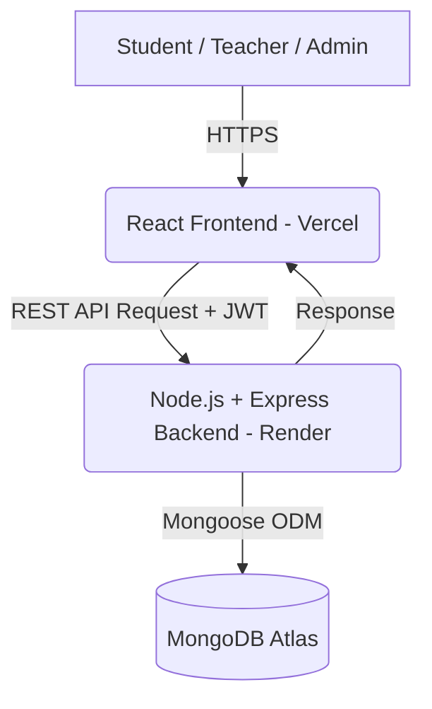

# Smart QR-Based Attendance Management System


## Overview
A production-ready, highly secure, and optimized QR-Based Attendance Management System tailored for modern educational institutions. Built with the **MERN Stack** (MongoDB, Express, React, Node.js), this platform entirely digitizes the traditional roll-call process through dynamic QR codes, geospatial fencing, and real-time dashboard analytics.

## Problem Statement
Traditional attendance systems rely on paper-based roll calls or biometric scanners which are time-consuming, prone to proxy attendance, unhygienic, and difficult to manage at scale. Compiling monthly reports and analyzing student attendance data is often a manual, error-prone task.

## Solution
Our Smart Attendance Management System shifts this paradigm by enabling teachers to generate dynamic, short-lived QR codes directly from their dashboard. Students scan these codes using their own mobile devices. The system ensures robust security using tokenized QR validation, time expiries, duplicate-prevention, and optional geolocation constraints, all while providing deep analytics for administration.

---

## Features

### 🎓 Student Experience
- **Mobile-Optimized QR Scanner:** Scan dynamic QR codes from teachers seamlessly with built-in camera integrations.
- **Attendance Dashboard:** Real-time visibility into overall attendance percentages and subject-wise metrics.
- **Low Attendance Warning:** Automated alerts when attendance drops below the minimum required threshold.
- **Attendance History:** Chronological logs of all attended sessions.

### 👨‍🏫 Teacher Experience
- **Create Attendance Sessions:** Generate secure sessions tied to specific subjects and classes.
- **Dynamic QR Generation:** Projected QR codes that expire automatically to prevent sharing.
- **Monitor Attendance:** Live counters showing how many students have scanned the current session.
- **Reports & Export:** Detailed attendance reports per subject with CSV/Excel export functionality.

### 🛡️ Admin Experience
- **Role Management:** Full CRUD operations on Students and Teachers.
- **Class & Subject Management:** Define the institutional structure.
- **Global Attendance Monitoring:** Oversee attendance metrics across the entire college.
- **Analytics:** Comprehensive institutional reports.

---

## Tech Stack

**Frontend:**
- **React.js** (Vite)
- **Tailwind CSS** (UI Styling & Responsiveness)
- **Axios** (API Client)
- **React Router** (SPA Navigation)
- **Recharts** (Data Visualization)
- **Vite PWA** (Progressive Web App support)

**Backend:**
- **Node.js** & **Express.js** (REST API)
- **JSON Web Tokens (JWT)** (Authentication)
- **Bcrypt.js** (Password Hashing)
- **Helmet & Express Rate Limit** (Security)

**Database:**
- **MongoDB Atlas**
- **Mongoose** (ODM & Validation)

---

## System Architecture



## QR Attendance Flow

1. **Teacher Login:** Authenticates and selects a class/subject.
2. **Session Creation:** Backend creates a new `AttendanceSession` document with a unique ID and `expiresAt` timestamp.
3. **QR Projection:** Frontend generates a QR code containing the session ID and a cryptographically signed token.
4. **Student Scan:** Student scans the QR code via their dashboard on a mobile device.
5. **Validation:** Backend verifies the JWT token, checks if the session is active, ensures the student is enrolled in the subject, and verifies the student hasn't already marked attendance.
6. **Success:** Attendance record is committed to the database, and real-time feedback is shown on both student and teacher dashboards.

---

## Project Structure

```text
smartattendance/
├── backend/                  # Express.js REST API
│   ├── src/
│   │   ├── controllers/      # Route logic
│   │   ├── middleware/       # Auth, Role, Error & Security middlewares
│   │   ├── models/           # Mongoose schemas
│   │   ├── routes/           # API definitions
│   │   ├── services/         # Business logic (QR, Emails)
│   │   └── utils/            # Helpers
│   ├── .env.example
│   └── server.js             # Entry point
├── frontend/                 # React SPA
│   ├── src/
│   │   ├── assets/           # Static files
│   │   ├── components/       # Reusable UI components
│   │   ├── context/          # React Context (Auth)
│   │   ├── layouts/          # Admin/Teacher/Student layouts
│   │   ├── pages/            # View components
│   │   └── services/         # Axios API interceptors
│   ├── public/
│   ├── .env.example
│   └── vite.config.js        # Build configuration
└── README.md
```

---

## API Overview

**Authentication:**
- `POST /api/auth/login` - User login
- `GET /api/auth/me` - Get current user profile

**Attendance:**
- `POST /api/attendance/session` - Create a new attendance session (Teacher)
- `POST /api/attendance/mark` - Mark attendance via QR scan (Student)
- `GET /api/attendance/history` - Get attendance records

**Admin / Management:**
- `GET /api/admin/users` - List all users
- `POST /api/admin/users` - Create a new user
- `GET /api/admin/subjects` - Manage subjects

---

## Environment Variables

### Backend (`backend/.env`)
| Variable | Description |
|----------|-------------|
| `MONGO_URI` | MongoDB Atlas Connection String |
| `JWT_SECRET` | Strong cryptographic secret for signing tokens |
| `JWT_EXPIRES_IN` | Token expiration (e.g., `7d`) |
| `PORT` | API Port (Default: 5000) |
| `FRONTEND_URL` | Allowed origin for CORS (e.g., Vercel URL) |
| `NODE_ENV` | `development` or `production` |
| `GEOFENCING_ENABLED` | Set to `true` or `false` to toggle GPS validation |

### Frontend (`frontend/.env`)
| Variable | Description |
|----------|-------------|
| `VITE_API_URL` | Backend REST API Base URL |

> ⚠️ **SECURITY WARNING:** Never commit `.env` files. Use `.env.example` as templates.

---

## Local Setup

### 1. Clone & Install
```bash
git clone https://github.com/yourusername/smartattendance.git
cd smartattendance
```

### 2. Backend Initialization
```bash
cd backend
npm install
cp .env.example .env  # Update variables inside .env
npm run seed          # (Optional) Seed database with demo data
npm run dev           # Starts API on http://localhost:5000
```

### 3. Frontend Initialization
```bash
cd ../frontend
npm install
cp .env.example .env  # Ensure VITE_API_URL is set
npm run dev           # Starts React app on http://localhost:5173
```

---

## Deployment

**Frontend (Vercel/Netlify):**
1. Set the root directory to `frontend`.
2. Add `VITE_API_URL` environment variable pointing to your production backend.
3. The repository includes `vercel.json` and `public/_redirects` to correctly handle SPA React Router fallbacks.

**Backend (Render/Railway):**
1. Set the root directory to `backend`.
2. Define all environment variables (especially `MONGO_URI`, `JWT_SECRET`, and `FRONTEND_URL`).
3. Build Command: `npm install`
4. Start Command: `npm start`

---

## Security Highlights
- **Rate Limiting:** Protects `/api/auth/login` from brute-force attacks.
- **Helmet Headers:** Secures Express apps by setting various HTTP headers.
- **CORS Configuration:** Strictly limits API access to the designated `FRONTEND_URL`.
- **JWT Authorization:** Role-based middleware ensures standard students cannot access teacher endpoints.
- **Database Safety:** Mongoose schemas enforce data validation and prevent duplicate attendance entries.

---

## Future Enhancements
- Face recognition integration alongside QR scanning for dual-factor presence verification.
- Offline support via Service Workers (PWA) to allow attendance sync when the network returns.
- Push notifications for class cancellations and schedule changes.
- Automated email digests for parents/guardians regarding low attendance.
